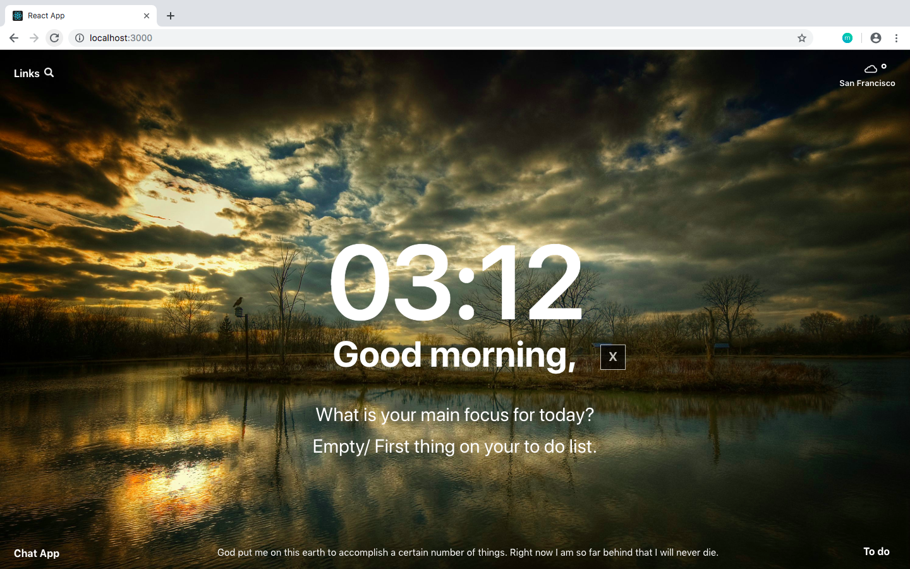
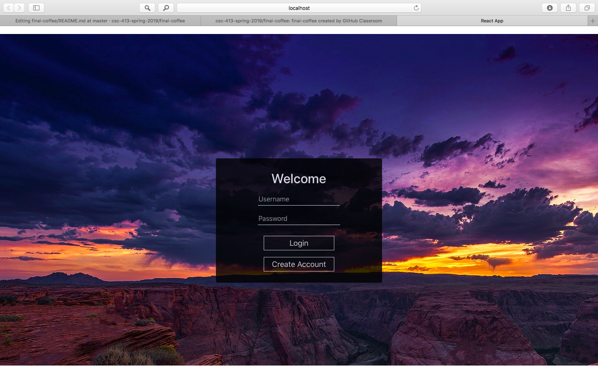
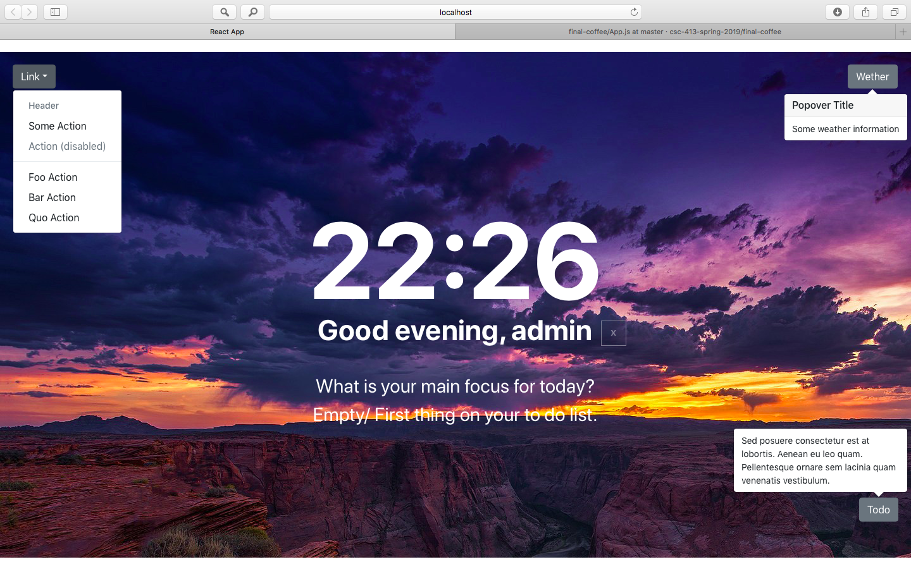

# Momentum
Momentum is a web app that developed inspired by Google Chrome Momentum. It has some of the functions that Chrome Momentum does, such as todo list, serch area, daily goal, and the Sanfrancisco weather border ect. In addition, we added a create/ login page to the app as it is the requirement.

### Final Page

#### Once you run it, it should take you to the main page (see the screenshot). If you want to try it from the login page, just change the " line 34:  isLoggedIn:true, -> isLoggedIn:false,". 

### Login page

### Create Account page.

###Clock is updated!!The greeting changes based on the time (morning, afternoon and evening). But I haven't pushed it. -JunMin

### 4-19. Quote on bottom center is working. Utilizes a random quote generating API.

