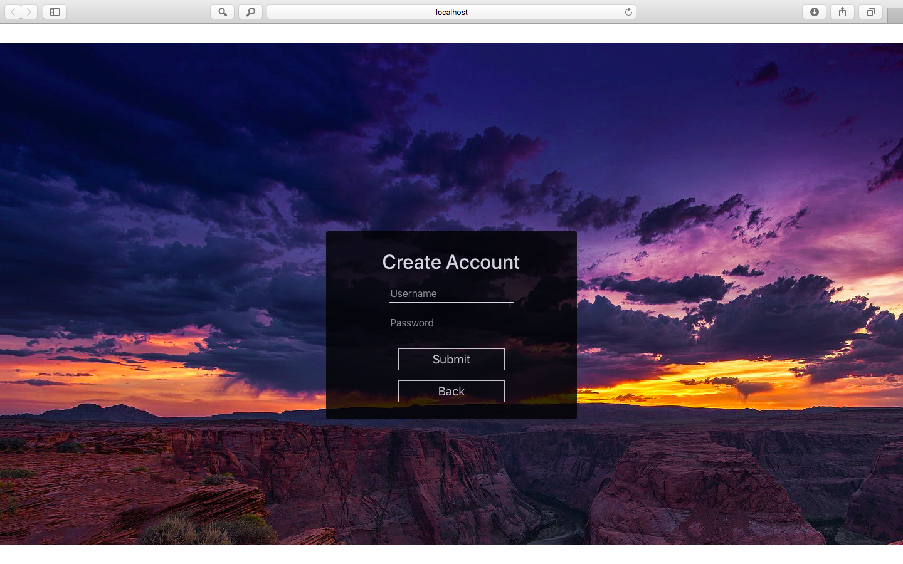

# Momentum
### Development cycle: 3 weeks
Momentum is a web app that developed inspired by Google Chrome Momentum. It has some of the functions that Chrome Momentum does, such as todo list, serch area, daily goal, and the Sanfrancisco weather border ect. In addition, we added a create/ login page to the app as it is the requirement.

- Clock - Generated by system time. 
- Greeting - The greeting changes based on the time (morning, afternoon and evening).
- Quote - Quote on bottom center is utilized from a random quote generating API.
- Weather - The weather of SanFrancisco is utilized from a third-party API.
- Link - This button can be use as add to Favorites.
- Search - Link to google to search the user input.
- Chat App - a chatting simulator which use to test web socket.

### Final Page

### Login page

### Create Account page

# Architecture
- Front-end: React, Javascript
- Back-end: Java, Spark, MongoDB

