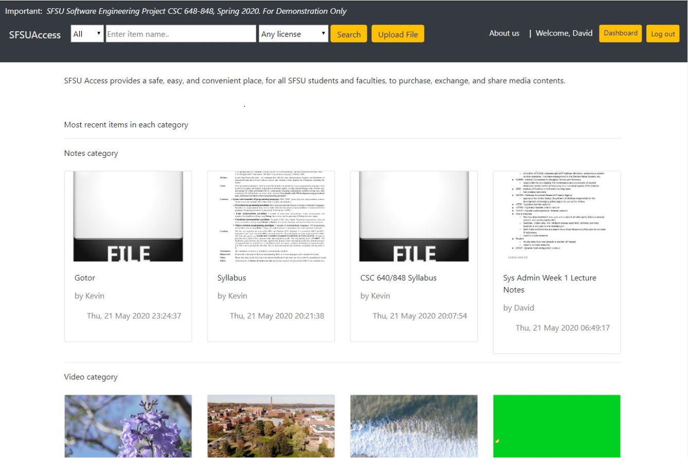
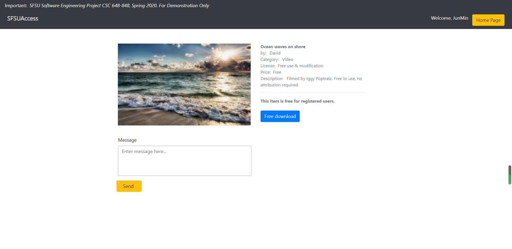
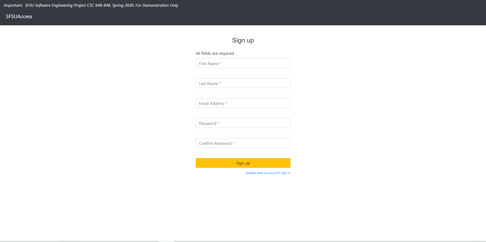
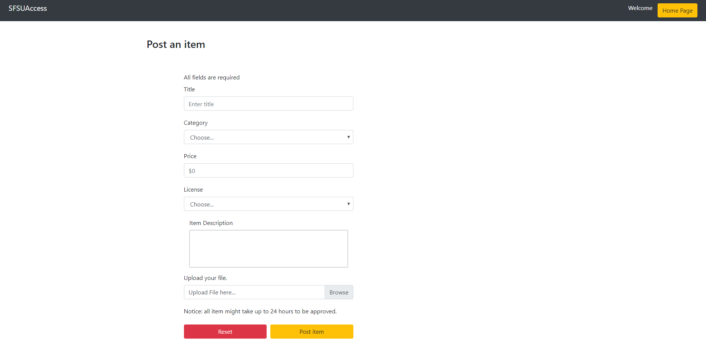
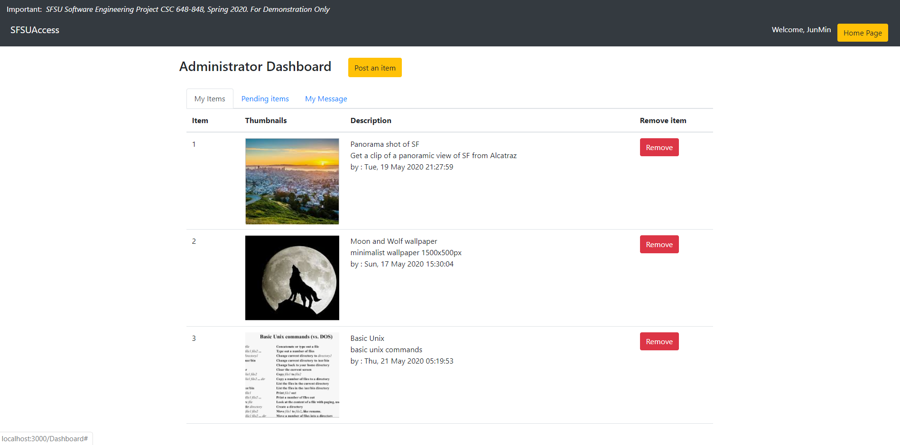
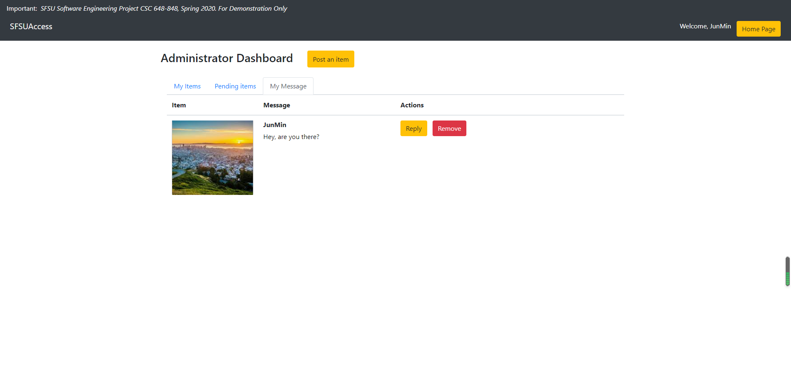
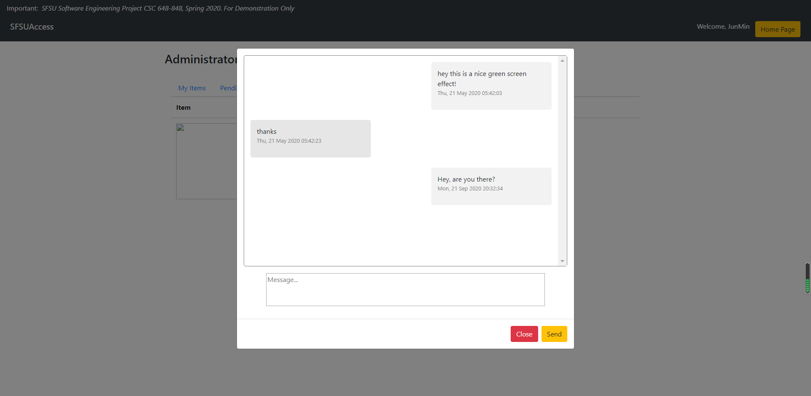

# SFSUACCESS
### Development cycle: 6 weeks
The main function of this project, called SFSU Access, is providing an e-commerce platform for SFSU students and faculties to buy, exchange and share media contents. The market function allows people to browse media contents posted by other members or themselves. The member login function allows users to post, buy, and download contents after they have logged in to their accounts. The admin function allows website administrators to manage the contents posted by users to make sure the contents are safe and appropriate.
### Final product 

- Users are able to search and browse all items

### Product info 

- Users are able to view item details after clicking an item.
- For example, this is a free item.  A registered user is able to download this item.

### Sign up  

- All fields are mandatory. Email and password are required for log in to the account.

### Upload item  

 - Users are able to post items(PDF,MP4,JPG,PNG files only) for sale or download.

### Dashboard 

- Users are able to remove/ view all their posted items and messages on their dashboard.

### Message

- Users are able to message seller using in-site message prefilled with product info.

The major committed functions are:
Non-registered users:
1. All listings provided by registered users shall be made viewable by non-registered users.
2. Users shall be able to search and browse all items
3. Users shall be able to view item details after clicking an item
4. Users shall register before being able to purchase or download items.
5. Users shall be able to create an account to engage in activity on the service. Registration shall require an SFSU email address.

Registered users:
1. Users shall be able to do everything that Non-registered users can.
2. Posting items to the store shall be subject to Admin approval.
3. Users shall be able to log in on the website.
4. Users shall be able to send and receive messages.
5. Users shall be able to post items for sale or download.
6. Users shall be able to remove their posted items.
7. Users shall be able to view all posted items and messages
8. Users shall be able to message seller using in-site message prefilled with product info

Administrator:
1. The admin shall be required to approve or deny pending listings.

