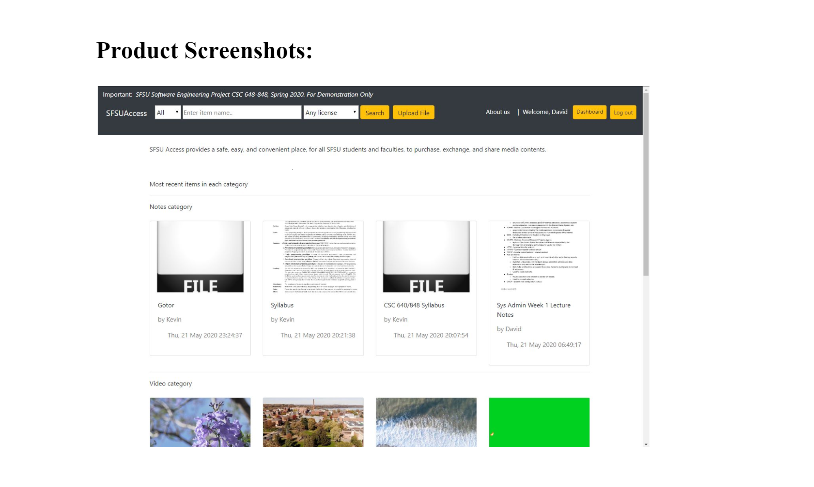

### This is a screenshot of the project. 

The major committed functions are:
Non-registered users:
1. All listings provided by registered users shall be made viewable by non-registered users.
2. Users shall be able to search and browse all items
3. Users shall be able to view item details after clicking an item
4. Users shall register before being able to purchase or download items.
5. Users shall be able to create an account to engage in activity on the service. Registration shall require an SFSU email address.

Registered users:
1. Users shall be able to do everything that Non-registered users can.
2. Posting items to the store shall be subject to Admin approval.
3. Users shall be able to log in on the website.
4. Users shall be able to send and receive messages.
5. Users shall be able to post items for sale or download.
6. Users shall be able to remove their posted items.
7. Users shall be able to view all posted items and messages
8. Users shall be able to message seller using in-site message prefilled with product info

Administrator:
1. The admin shall be required to approve or deny pending listings.

